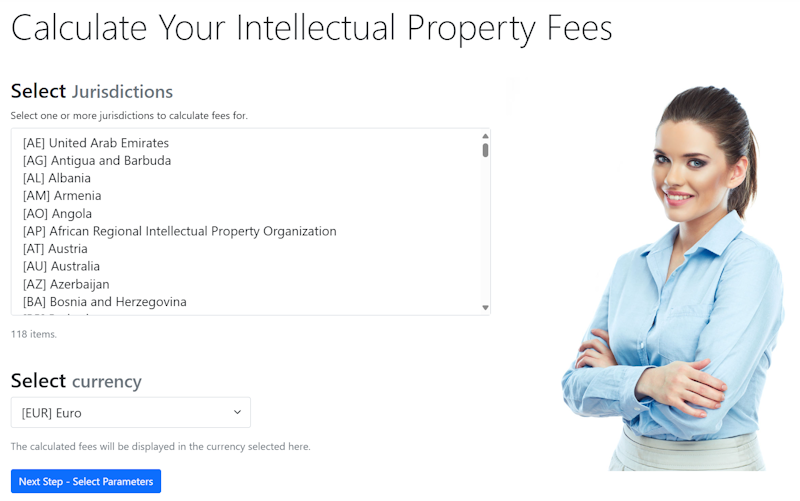

# IPFees - Intellectual Property Fee Calculator

[](https://dotnet.microsoft.com)
[](https://docker.com)
[](https://mongodb.com)
[](https://github.com/ipfees/ipfees)
[](https://opensource.org/licenses/MIT)
[](https://localhost:8090/swagger)



## Code Metadata

| Metadata Item | Description |
|---------------|-------------|
| **Current code version** | v1.0.0 |
| **Permanent link to code/repository** | https://github.com/[username]/ipfees |
| **Legal Code License** | MIT License |
| **Code versioning system used** | Git |
| **Software code languages, tools, and services used** | C# (.NET 9.0), ASP.NET Core, MongoDB, Docker, Razor Pages, Bootstrap 5, jQuery, xUnit |
| **Compilation requirements, operating environments & dependencies** | .NET 9.0 SDK, Docker & Docker Compose, MongoDB 8.0+; Compatible with Windows, Linux, macOS |
| **Link to developer documentation/manual** | [Developer Guide](docs/DEVELOPER.md) |
| **Support email for questions** | GitHub Issues or Discussions |

## Overview

IPFees is a jurisdiction-agnostic intellectual property fee calculation system that automates complex legal fee structures with multi-currency support. The platform provides automated fee calculations across 160+ global IP jurisdictions using a Domain-Specific Language (DSL) approach, enabling legal professionals to define and modify fee calculation rules without software development expertise.

## Quick Start with Docker

### Prerequisites

- [Docker](https://docker.com) and Docker Compose

### Start the Application

```bash
# Clone the repository
git clone <repository-url>
cd ipfees/src

# Start all services
docker-compose up -d
```

### Access the Application

- **Web Application**: http://localhost:8080
- **API Documentation**: http://localhost:8090/swagger
- **MongoDB**: localhost:27017

That's it! The system includes sample data and will work immediately. For production use, configure your exchange rate API key in the settings.

### Running Tests

```bash
# Run all tests
dotnet test

# Run specific test project
dotnet test IPFees.Core.Tests
dotnet test IPFees.Calculator.Tests
```

## Technical Architecture

IPFees leverages a modular architecture designed specifically for the demands of global IP practice, addressing complex requirements of many distinct regulatory frameworks.

For a detailed technical architecture diagram, see [architecture.md](architecture.md).

### Technology Stack

- **Backend**: .NET 9.0, ASP.NET Core
- **Frontend**: Razor Pages, Bootstrap 5
- **Database**: MongoDB with GridFS
- **Containerization**: Docker & Docker Compose
- **Background Services**: .NET BackgroundService
- **Expression Parsing**: Custom DSL interpreter
- **Testing**: xUnit, Testcontainers

### Key Features

- **DSL-Based Fee Calculation**: Define complex fee structures in human-readable format without hardcoding business logic
- **Multi-Jurisdiction Support**: Configurable architecture supporting USPTO, EPO, WIPO, and 160+ national patent offices
- **Real-Time Currency Management**: Multi-currency precision with real-time conversion, historical rate tracking, and three-tier fallback system
- **API-First Design**: Comprehensive REST APIs for integration with IP management platforms
- **Bulk Processing**: Portfolio-level fee estimation for large IP holdings
- **Extensible Architecture**: Add new jurisdictions through configuration without code changes

## Illustrative Examples

### Example 1: USPTO Utility Patent Filing Fee

Calculate filing fees for a small entity utility patent application:

```bash
# Using the API
curl -X POST http://localhost:8090/api/fees/calculate \
  -H "Content-Type: application/json" \
  -d '{
    "jurisdiction": "USPTO",
    "feeType": "UtilityFiling",
    "entitySize": "Small",
    "claims": 25,
    "independentClaims": 15
  }'
```

**Result**: System calculates base filing fee, search fee, examination fee, and excess claim fees based on current USPTO fee schedule with multi-currency output.

### Example 2: EPO Validation Fee Calculation

Calculate validation fees across multiple European countries:

```bash
# Bulk calculation for EP patent validation
POST /api/fees/bulk-calculate
{
  "patents": [
    {"country": "DE", "claims": 10},
    {"country": "FR", "claims": 10},
    {"country": "GB", "claims": 10},
    {"country": "IT", "claims": 10},
    {"country": "ES", "claims": 10}
  ],
  "targetCurrency": "EUR"
}
```

**Result**: Aggregated validation costs with currency conversion and jurisdiction-specific requirements.

### Example 3: Custom DSL Fee Rule

Define a new fee structure using the DSL:

```
// Example: Progressive claim-based fee calculation
BaseFee = 500
ClaimFee = Claims > 20 ? (Claims - 20) * 100 : 0
IndependentClaimFee = IndependentClaims > 3 ? (IndependentClaims - 3) * 420 : 0
TotalFee = BaseFee + ClaimFee + IndependentClaimFee
```

The DSL parser evaluates rules at runtime, supporting conditional logic and arithmetic operations.

## Scientific Impact and Reusability

### Cross-Domain Applicability

While developed for IP fee management, the DSL-based architecture is applicable to other regulatory domains:
- International tax calculations
- Customs and import duty calculations  
- Legal compliance fee structures
- Multi-jurisdiction regulatory reporting

### Research Applications

- **Legal Technology Research**: Framework for studying automated compliance systems
- **Domain-Specific Languages**: Reference implementation for regulatory rule engines
- **Multi-Currency Systems**: Pattern for handling financial calculations across jurisdictions
- **API Integration Studies**: Example of REST API design for legal technology

### Extensibility

The modular architecture enables researchers and practitioners to:
1. Add new jurisdictions through JSON configuration
2. Implement custom currency providers
3. Extend the DSL with domain-specific functions
4. Integrate with existing IP management systems via REST APIs

## Performance Metrics

- **Calculation Latency**: <500ms for complex multi-jurisdiction calculations
- **Multi-Currency Precision**: 6-8 decimal places for high-value portfolios
- **Currency Support**: 150+ currencies with real-time conversion
- **Concurrent Users**: Scalable architecture supporting multiple simultaneous users
- **Extensibility**: Add jurisdictions without code changes through configuration

## Citation

If you use IPFees in your research, please cite:

```bibtex
@software{ipfees2025,
  title = {IPFees: Intellectual Property Fee Calculator},
  author = {[Author Name]},
  year = {2025},
  version = {1.0.0},
  url = {https://github.com/[username]/ipfees},
  license = {MIT}
}
```

See [CITATION.cff](CITATION.cff) for structured citation metadata.

## Contributing

We welcome contributions from the community:

1. Fork the repository
2. Create a feature branch (`git checkout -b feature/amazing-feature`)
3. Commit your changes (`git commit -m 'Add amazing feature'`)
4. Push to the branch (`git push origin feature/amazing-feature`)
5. Open a Pull Request

For major changes, please open an issue first to discuss proposed modifications. See [CONTRIBUTING.md](CONTRIBUTING.md) for detailed guidelines.

## License

This project is licensed under the MIT License - see the [LICENSE](LICENSE) file for details. This OSI-approved license permits academic research, commercial use, modification, and integration into other projects.

## Documentation

- **User Guide**: See web application's built-in documentation at `/about` and `/reference`
- **API Documentation**: Interactive Swagger/OpenAPI documentation at `/swagger`
- **Architecture**: Detailed technical architecture in [architecture.md](architecture.md)
- **Developer Guide**: Instructions for extending the system in [docs/DEVELOPER.md](docs/DEVELOPER.md)
- **DSL Grammar**: Fee calculation DSL specification at `/grammar`

## Support & Contact

- **Issues**: Report bugs and request features via [GitHub Issues](https://github.com/[username]/ipfees/issues)
- **Discussions**: Community support via [GitHub Discussions](https://github.com/[username]/ipfees/discussions)
- **Documentation**: Comprehensive documentation in the `/docs` folder
- **Email**: [contact email for institutional inquiries]

## Acknowledgments

IPFees addresses documented inefficiencies in IP fee management where professionals spend significant time on repetitive calculations across fragmented government-provided calculators and limited commercial solutions. The platform aims to improve efficiency through automation while maintaining open-source principles for research and educational use.

---

**Version**: 1.0.0  
**Status**: Active Development  
**Repository**: https://github.com/[username]/ipfees
