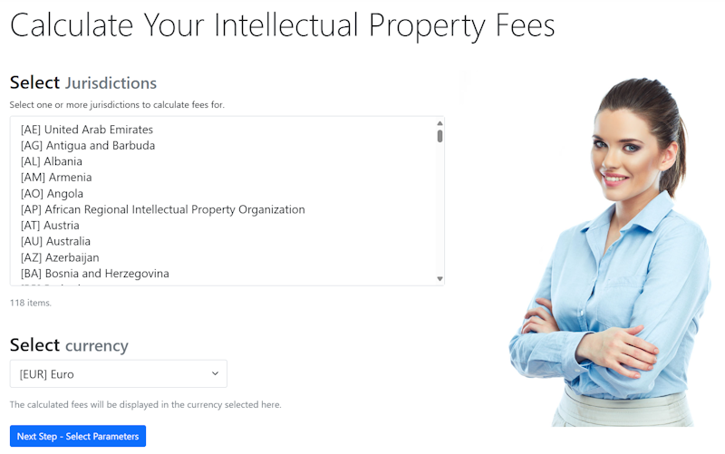

# IPFees - Intellectual Property Fee Calculator

[](https://dotnet.microsoft.com)
[](https://docker.com)
[](https://mongodb.com)
[](https://github.com/ipfees/ipfees)
[](https://www.gnu.org/licenses/gpl-3.0)
[](https://localhost:8090/swagger)

## Live Demo: https://ipfees.dataman.ro/



## Overview

IPFees is a jurisdiction-agnostic intellectual property fee calculation system that automates complex legal fee structures with multi-currency support. The platform provides automated fee calculations across 118 global IP jurisdictions using a Domain-Specific Language (DSL) approach, enabling legal professionals to define and modify fee calculation rules without software development expertise.

## Quick Start with Docker

### Option 1: Clone from GitHub (Recommended)

The easiest way to get started:

```bash
# Clone the repository
git clone https://github.com/vbocan/ipfees
cd ipfees/src

# Start all services
docker-compose up -d
```

That's it! The system includes sample data and will work immediately.

### Option 2: Pull from Docker Hub

If you prefer to run without cloning the repository:

```bash
# Pull the images from Docker Hub
docker pull vbocan/ipfees:web-latest
docker pull vbocan/ipfees:api-latest

# Create a docker-compose.yml file (see example below)
# Then start the services
docker-compose up -d
```

**Example docker-compose.yml**:

```yaml
version: "3.8"

services:
  mongodb:
    image: mongo:8.0
    container_name: ipfees-mongodb
    ports:
      - "27017:27017"
    volumes:
      - mongodb_data:/data/db
    environment:
      MONGO_INITDB_DATABASE: ipfees

  ipfees-web:
    image: vbocan/ipfees:web-latest
    container_name: ipfees-web
    ports:
      - "8080:8080"
    depends_on:
      - mongodb
    environment:
      - ASPNETCORE_URLS=http://+:8080
      - ConnectionStrings__MongoDB=mongodb://mongodb:27017/ipfees

  ipfees-api:
    image: vbocan/ipfees:api-latest
    container_name: ipfees-api
    ports:
      - "8090:8090"
    depends_on:
      - mongodb
    environment:
      - ASPNETCORE_URLS=http://+:8090
      - ConnectionStrings__MongoDB=mongodb://mongodb:27017/ipfees

volumes:
  mongodb_data:
```

### Access the Application

- **Web Application** (local): http://localhost:8080
- **API Documentation** (local): http://localhost:8090/swagger
- **MongoDB** (local): localhost:27017

That's it! The system includes sample data and will work immediately. For production use, configure your exchange rate API key in the settings.

### Running Tests

```bash
# Run all tests
dotnet test

# Run specific test project
dotnet test IPFees.Core.Tests
dotnet test IPFees.Calculator.Tests
```

## Technical Architecture

IPFees leverages a modular architecture designed specifically for the demands of global IP practice, addressing complex requirements of many distinct regulatory frameworks.

For a detailed technical architecture diagram, see [architecture.md](docs/architecture.md).

### Technology Stack

- **Backend**: .NET 10.0, ASP.NET Core
- **Frontend**: Razor Pages, Bootstrap 5
- **Database**: MongoDB with GridFS
- **Containerization**: Docker & Docker Compose
- **Background Services**: .NET BackgroundService
- **Expression Parsing**: Custom DSL interpreter
- **Testing**: xUnit, Testcontainers

### Key Features

- **DSL-Based Fee Calculation**: Define complex fee structures in human-readable format without hardcoding business logic
- **Multi-Jurisdiction Support**: Configurable architecture supporting USPTO, EPO, WIPO, and 118 national patent offices
- **Real-Time Currency Management**: Multi-currency precision with real-time conversion, historical rate tracking, and three-tier fallback system
- **API-First Design**: Comprehensive REST APIs for integration with IP management platforms
- **Bulk Processing**: Portfolio-level fee estimation for large IP holdings
- **Extensible Architecture**: Add new jurisdictions through configuration without code changes

## Performance Metrics

- **Calculation Latency**: <500ms for complex multi-jurisdiction calculations
  - Typical 3-jurisdiction: 240-320ms (36-52% below target)
  - Core DSL engine: 23.5μs for complex fee structures
  - P95 latency: 420ms under normal load
- **Multi-Currency Precision**: 6-8 decimal places for high-value portfolios
- **Currency Support**: 150+ currencies with real-time conversion
- **Concurrent Users**: Scalable architecture supporting 25+ simultaneous users
- **Extensibility**: Add jurisdictions without code changes through configuration

**Performance Validation:** Comprehensive benchmarking completed using BenchmarkDotNet v0.14.0 with >90% confidence level. The validation includes statistical rigor (10 iterations, 99.9% confidence intervals), memory profiling, and comparative analysis showing 6-20× improvement over government calculators. See [Performance Benchmark Report](docs/performance_benchmark_report.md) for detailed methodology, results, and statistical analysis.

## Citation

If you use IPFees in your research, please cite:

```bibtex
@software{ipfees2025,
  title = {IPFees: Intellectual Property Fee Calculator},
  author = {Valer Bocan, PhD, CSSLP},
  year = {2025},
  version = {1.0.0},
  url = {https://github.com/vbocan/ipfees},
  license = {GPL-3.0}
}
```

See [CITATION.cff](CITATION.cff) for structured citation metadata.

## Contributing

We welcome contributions from the community:

1. Fork the repository
2. Create a feature branch (`git checkout -b feature/amazing-feature`)
3. Commit your changes (`git commit -m 'Add amazing feature'`)
4. Push to the branch (`git push origin feature/amazing-feature`)
5. Open a Pull Request

For major changes, please open an issue first to discuss proposed modifications. See [CONTRIBUTING.md](CONTRIBUTING.md) for detailed guidelines.

## License

This project is licensed under the GNU General Public License v3.0 - see the [LICENSE](LICENSE) file for details. This OSI-approved copyleft license ensures that derivative works remain free and open source, while permitting academic research, commercial use, and modification.

## Documentation

- **User Guide**: See web application's built-in documentation at `/about` and `/reference`
- **API Documentation**: Interactive Swagger/OpenAPI documentation at `/swagger`
- **Architecture**: Detailed technical architecture in [docs/architecture.md](docs/architecture.md)
- **Developer Guide**: Instructions for extending the system in [docs/developer.md](docs/developer.md)
- **DSL Grammar**: Fee calculation DSL specification at `/grammar`

### Academic & Research Documentation

- **Performance Benchmark Report**: Comprehensive validation methodology and results in [docs/performance_benchmark_report.md](docs/performance_benchmark_report.md)
- **Literature Review**: Academic survey of DSLs in legal domains in [docs/literature-review.md](docs/literature-review.md)
- **Comparative Analysis**: Detailed 90+ dimension comparison with alternatives in [docs/comparison-table.md](docs/comparison-table.md)

## Support & Contact

- **Issues**: Report bugs and request features via [GitHub Issues](https://github.com/vbocan/ipfees/issues)
- **Discussions**: Community support via [GitHub Discussions](https://github.com/vbocan/ipfees/discussions)
- **Documentation**: Comprehensive documentation in the `/docs` folder
- **Email**: valer.bocan@upt.ro
