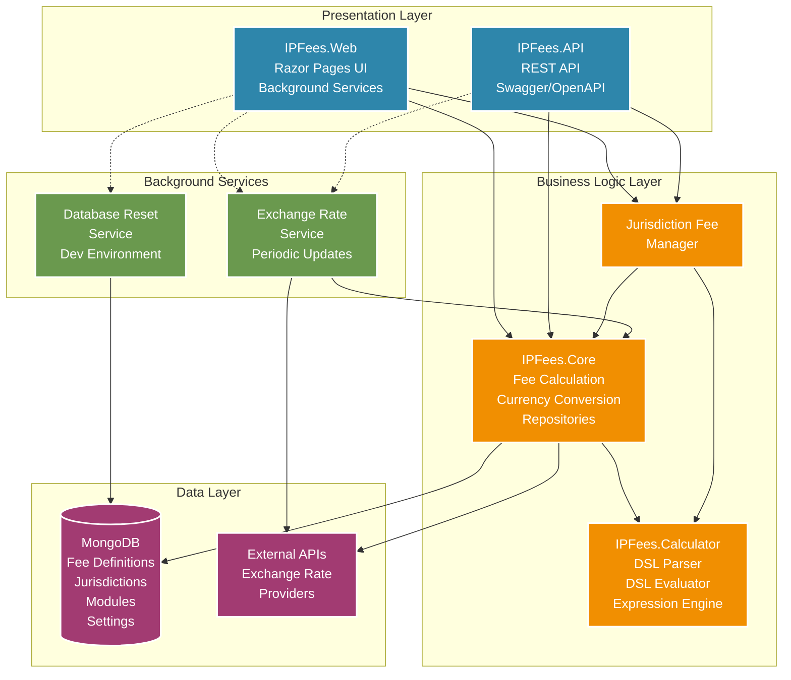

# IPFees Technical Architecture



## Architecture Overview

The IPFees system is built using a clean, layered architecture with clear separation of concerns. The actual implementation consists of four main .NET projects working together to provide IP fee calculation services.

### Presentation Layer

#### IPFees.Web
- **Technology**: ASP.NET Core Razor Pages with Bootstrap 5
- **Purpose**: Primary user interface for interactive fee calculations
- **Responsibilities**:
  - User interface for fee calculations
  - Jurisdiction and module management
  - Settings configuration
  - Hosts background services (ExchangeRateService, DatabaseResetService)
- **Key Features**: Responsive design, real-time calculations, administrative interface

#### IPFees.API
- **Technology**: ASP.NET Core Web API with Swagger/OpenAPI
- **Purpose**: RESTful API for external integrations and automation
- **Responsibilities**:
  - REST endpoints for fee calculations
  - API key authentication
  - Bulk calculation support
  - External system integration
- **Endpoints**: `/api/v1/Fee`, `/api/v1/Jurisdiction`, `/api/v1/Currency`

### Business Logic Layer

#### IPFees.Core
- **Purpose**: Core business logic and domain models
- **Key Components**:
  - `FeeCalculation`: Fee calculation orchestration
  - `CurrencyConversion`: Multi-currency support with exchange rate fetching
  - `Repository`: Data access abstractions (Fee, Jurisdiction, Module, Settings)
  - `FeeManager`: Jurisdiction-specific fee management
  - `Model`: Domain entities (FeeDoc, JurisdictionDoc, ModuleDoc)
  - `Data`: MongoDB data context
- **Dependencies**: IPFees.Calculator, MongoDB.Driver

#### IPFees.Calculator (Critical Component)
- **Purpose**: Domain-Specific Language (DSL) engine - the heart of IPFees
- **Key Components**:
  - `Parser`: DSL syntax parser (DslParser, DslSemanticChecker)
  - `Evaluator`: Expression evaluator (DslEvaluator, node types)
  - `Calculator`: DSL calculator orchestration (DslCalculator)
- **Technology**: Custom lexer/parser with AST evaluation
- **Note**: This is a standalone project with **no external dependencies**
- **Capabilities**: 
  - Parses IPFLang DSL syntax
  - Evaluates complex fee expressions
  - Supports variables, functions, conditionals
  - Type checking and semantic validation

#### Jurisdiction Fee Manager
- **Purpose**: Manages jurisdiction-specific fee calculations
- **Integration**: Bridges Core and Calculator components
- **Responsibilities**: Coordinates fee calculation workflow across jurisdictions

### Data Layer

#### MongoDB
- **Technology**: MongoDB 8.0+ document database
- **Collections**:
  - `fees`: Fee definitions with DSL source code
  - `jurisdictions`: Jurisdiction metadata and configuration
  - `modules`: Reusable DSL modules
  - `serviceSettings`: System configuration
- **Note**: GridFS is **not currently implemented** despite architecture references
- **Access Pattern**: Repository pattern through IPFees.Core

#### External APIs
- **Exchange Rate Providers**: Multi-provider support for currency conversion
- **Fallback Mechanism**: Intelligent provider switching for resilience
- **Caching**: In-memory caching with periodic background updates

### Background Services (Hosted Services)

#### ExchangeRateService
- **Purpose**: Periodic currency exchange rate updates
- **Pattern**: .NET BackgroundService with periodic execution
- **Frequency**: Configurable update intervals
- **Providers**: Supports multiple exchange rate API providers

#### DatabaseResetService
- **Purpose**: Development environment database initialization
- **Use Case**: Resets database to sample data for testing
- **Environment**: Development only

## Actual Project Dependencies

```
IPFees.Web
  └── IPFees.Core
      └── IPFees.Calculator (standalone, no dependencies)

IPFees.API
  └── IPFees.Core
      └── IPFees.Calculator (standalone, no dependencies)

Test Projects:
  - IPFees.Core.Tests
  - IPFees.Calculator.Tests
  - IPFees.Performance.Tests
```

## Key Architectural Benefits

1. **Clean Separation**: Calculator is completely isolated, making the DSL engine reusable and testable
2. **Modular Design**: Each project has a single, well-defined responsibility
3. **Dependency Management**: Clear dependency hierarchy prevents circular references
4. **Testability**: Each layer can be tested independently (unit, integration, performance tests)
5. **Maintainability**: DSL changes are isolated to Calculator project
6. **Extensibility**: New jurisdictions added through database configuration, not code changes
7. **API-First**: Both Web and API share the same business logic through Core

## Technology Stack Summary

- **Framework**: .NET 9.0, ASP.NET Core
- **Frontend**: Razor Pages, Bootstrap 5, jQuery
- **Database**: MongoDB 8.0+ with official C# driver
- **DSL Engine**: Custom lexer/parser/evaluator
- **API**: RESTful with Swagger/OpenAPI documentation
- **Testing**: xUnit, BenchmarkDotNet, Testcontainers
- **Containerization**: Docker & Docker Compose
- **Logging**: Serilog