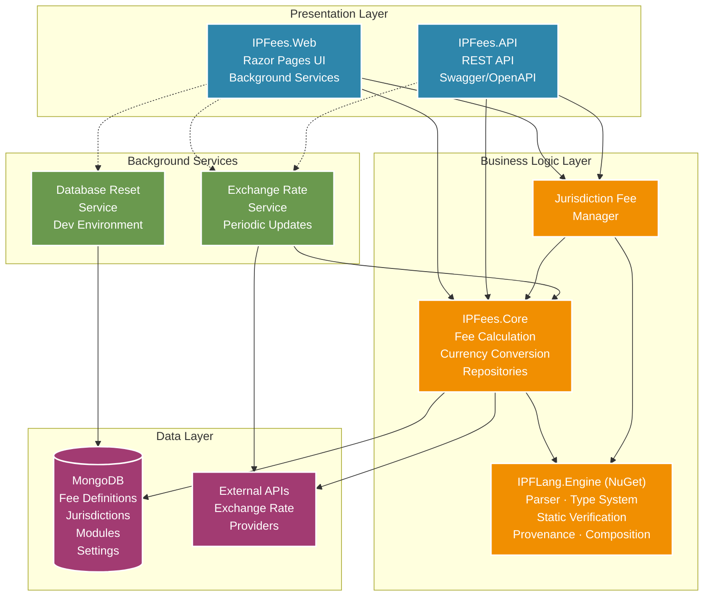

# IPFees Technical Architecture


```mermaid
graph TB
    %% Define subgraphs for layers
    subgraph "Presentation Layer"
        Web[IPFees.Web<br/>Razor Pages UI<br/>Background Services]
        API[IPFees.API<br/>REST API<br/>Swagger/OpenAPI]
    end

    subgraph "Business Logic Layer"
        Core[IPFees.Core<br/>Fee Calculation<br/>Currency Conversion<br/>Repositories]
        Calculator["IPFLang.Engine (NuGet)<br/>Parser · Type System<br/>Static Verification<br/>Provenance · Composition"]
        FeeManager[Jurisdiction Fee<br/>Manager]
    end

    subgraph "Data Layer"
        Mongo[(MongoDB<br/>Fee Definitions<br/>Jurisdictions<br/>Modules<br/>Settings)]
        ExternalAPI[External APIs<br/>Exchange Rate<br/>Providers]
    end

    subgraph "Background Services"
        ExchangeService[Exchange Rate<br/>Service<br/>Periodic Updates]
        ResetService[Database Reset<br/>Service<br/>Dev Environment]
    end

    %% Presentation to Business Logic
    Web --> Core
    Web --> FeeManager
    API --> Core
    API --> FeeManager

    %% Business Logic dependencies
    Core --> Calculator
    Core --> Mongo
    FeeManager --> Core
    FeeManager --> Calculator

    %% Background Services
    ExchangeService --> Core
    ExchangeService --> ExternalAPI
    ResetService --> Mongo
    Web -.-> ExchangeService
    Web -.-> ResetService
    API -.-> ExchangeService

    %% Data access
    Core --> ExternalAPI

    %% Styling
    classDef presentation fill:#2E86AB,stroke:#fff,stroke-width:2px,color:#fff
    classDef business fill:#F18F01,stroke:#fff,stroke-width:2px,color:#fff
    classDef data fill:#A23B72,stroke:#fff,stroke-width:2px,color:#fff
    classDef services fill:#6A994E,stroke:#fff,stroke-width:2px,color:#fff

    class Web,API presentation
    class Core,Calculator,FeeManager business
    class Mongo,ExternalAPI data
    class ExchangeService,ResetService services
```

## Architecture Overview

The IPFees system is built using a clean, layered architecture with clear separation of concerns. The actual implementation consists of four main .NET projects working together to provide IP fee calculation services.

### Presentation Layer

#### IPFees.Web
- **Technology**: ASP.NET Core Razor Pages with Bootstrap 5
- **Purpose**: Primary user interface for interactive fee calculations
- **Responsibilities**:
  - User interface for fee calculations
  - Jurisdiction and module management
  - Settings configuration
  - Hosts background services (ExchangeRateService, DatabaseResetService)
- **Key Features**: Responsive design, real-time calculations, administrative interface

#### IPFees.API
- **Technology**: ASP.NET Core Web API with Swagger/OpenAPI
- **Purpose**: RESTful API for external integrations and automation
- **Responsibilities**:
  - REST endpoints for fee calculations
  - API key authentication
  - Bulk calculation support
  - External system integration
- **Endpoints**: `/api/v1/Fee`, `/api/v1/Jurisdiction`, `/api/v1/Currency`

### Business Logic Layer

#### IPFees.Core
- **Purpose**: Core business logic and domain models
- **Key Components**:
  - `FeeCalculation`: Fee calculation orchestration
  - `CurrencyConversion`: Multi-currency support with exchange rate fetching
  - `Repository`: Data access abstractions (Fee, Jurisdiction, Module, Settings)
  - `FeeManager`: Jurisdiction-specific fee management
  - `Model`: Domain entities (FeeDoc, JurisdictionDoc, ModuleDoc)
  - `Data`: MongoDB data context
- **Dependencies**: IPFLang.Engine (NuGet package), MongoDB.Driver

#### IPFLang.Engine (external package)
- **Purpose**: The fee calculation language and its engine, consumed as a NuGet package
- **Source**: [github.com/vbocan/IPFLang](https://github.com/vbocan/IPFLang), GPL-3.0
- **Key Components**:
  - `Parser`: IPFLang syntax and semantic analysis
  - `Types`: Currency-aware type system over the 161 active ISO 4217 currencies
  - `Analysis`: Static completeness and monotonicity verification
  - `Provenance`: Execution traces and counterfactual analysis
  - `Composition`: Jurisdiction inheritance and override resolution
  - `Corpus`: The 118 production jurisdiction schedules, embedded in the assembly
- **Note**: Has **no external dependencies** of its own
- **Relationship**: IPFees does not implement a DSL. It stores IPFLang scripts, composes
  them, executes them, and surfaces the engine's static analysis to people who never see
  the language. The engine is described in the IEEE OJCS article cited in `CITATION.cff`.

#### Jurisdiction Fee Manager
- **Purpose**: Manages jurisdiction-specific fee calculations
- **Integration**: Bridges Core and Calculator components
- **Responsibilities**: Coordinates fee calculation workflow across jurisdictions

### Data Layer

#### MongoDB
- **Technology**: MongoDB 8.0+ document database
- **Collections**:
  - `fees`: Fee definitions with DSL source code
  - `jurisdictions`: Jurisdiction metadata and configuration
  - `modules`: Shared input declarations, applied through IPFLang jurisdiction composition
  - `serviceSettings`: System configuration
- **Note**: GridFS is **not currently implemented** despite architecture references
- **Access Pattern**: Repository pattern through IPFees.Core

#### External APIs
- **Exchange Rate Providers**: Multi-provider support for currency conversion
- **Fallback Mechanism**: Intelligent provider switching for resilience
- **Caching**: In-memory caching with periodic background updates

### Background Services (Hosted Services)

#### ExchangeRateService
- **Purpose**: Periodic currency exchange rate updates
- **Pattern**: .NET BackgroundService with periodic execution
- **Frequency**: Configurable update intervals
- **Providers**: Supports multiple exchange rate API providers

#### DatabaseResetService
- **Purpose**: Development environment database initialization
- **Use Case**: Resets database to sample data for testing
- **Environment**: Development only

## Actual Project Dependencies

```
IPFees.Web
  └── IPFees.Core
      └── IPFLang.Engine  [NuGet, no dependencies of its own]

IPFees.API
  └── IPFees.Core
      └── IPFLang.Engine  [NuGet, no dependencies of its own]

Test Projects:
  - IPFees.Core.Tests          repositories, validation, corpus equivalence
  - IPFees.Performance.Tests   BenchmarkDotNet suite
```

The language engine used to live in this repository as `IPFees.Calculator`. It was
extracted into IPFLang, formalised, and published; IPFees now consumes it as a versioned
package rather than carrying a copy. `IPFees.Core.Tests` includes an equivalence suite
holding the current corpus accountable to the fee schedules IPFees shipped before the
change.

## Key Architectural Benefits

1. **Clean Separation**: The language is a published package, so the platform and the DSL version and evolve independently
2. **Modular Design**: Each project has a single, well-defined responsibility
3. **Dependency Management**: Clear dependency hierarchy prevents circular references
4. **Testability**: Each layer can be tested independently (unit, integration, performance tests)
5. **Maintainability**: DSL changes are isolated to Calculator project
6. **Extensibility**: New jurisdictions added through database configuration, not code changes
7. **API-First**: Both Web and API share the same business logic through Core

## Technology Stack Summary

- **Framework**: .NET 10.0, ASP.NET Core
- **Frontend**: Razor Pages, Bootstrap 5, jQuery
- **Database**: MongoDB 8.0+ with official C# driver
- **DSL Engine**: Custom lexer/parser/evaluator
- **API**: RESTful with Swagger/OpenAPI documentation
- **Testing**: xUnit, BenchmarkDotNet, Testcontainers
- **Containerization**: Docker & Docker Compose
- **Logging**: Serilog