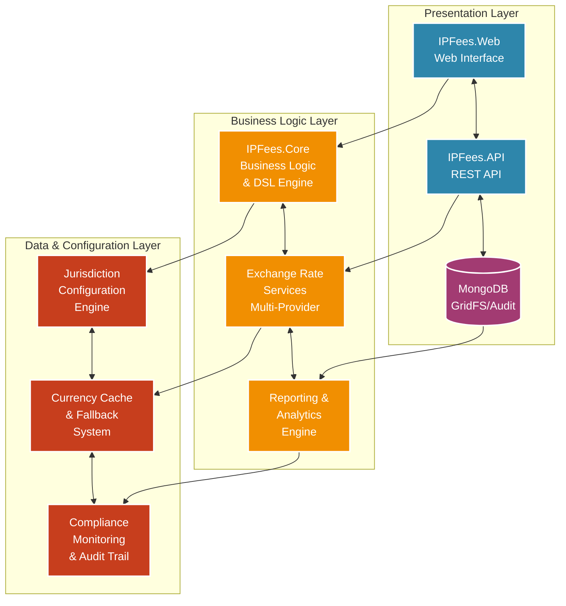

# IPFees Technical Architecture

## Architecture Overview

The IPFees system is built using a modular, three-tier architecture that provides clear separation of concerns and excellent scalability:

### Presentation Layer
- **IPFees.Web**: Razor Pages-based web application providing the user interface
- **IPFees.API**: RESTful API services for external integrations and mobile clients
- **MongoDB**: Document database with GridFS for file storage and comprehensive audit logging

### Business Logic Layer
- **IPFees.Core**: Contains the Domain-Specific Language (DSL) engine and core business logic
- **Exchange Rate Services**: Multi-provider currency conversion with intelligent fallback mechanisms
- **Reporting & Analytics Engine**: Comprehensive reporting and data analysis capabilities

### Data & Configuration Layer
- **Jurisdiction Configuration Engine**: Manages jurisdiction-specific fee rules and regulations
- **Currency Cache & Fallback System**: Handles currency data caching and backup mechanisms
- **Compliance Monitoring & Audit Trail**: Ensures regulatory compliance and maintains audit logs

## Key Architectural Benefits

1. **Modular Design**: Each component can be developed, tested, and deployed independently
2. **Scalability**: Horizontal scaling possible at each layer
3. **Resilience**: Multiple fallback mechanisms ensure high availability
4. **Maintainability**: Clear separation of concerns makes the system easy to maintain
5. **Extensibility**: New jurisdictions and features can be added without code changes